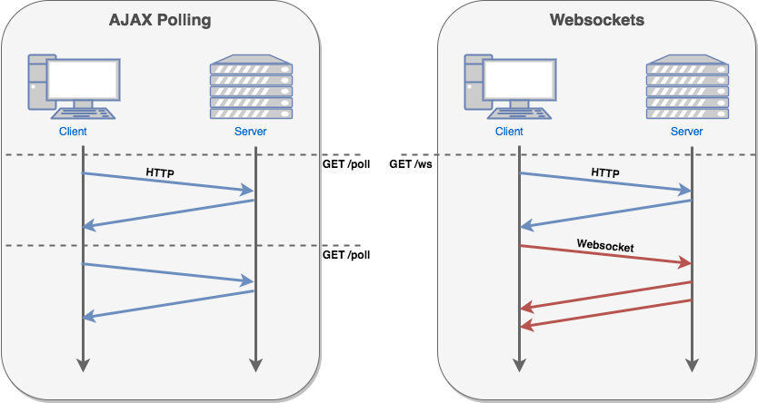

class: center, middle, background

#WebSockets: Socket.IO

.img-circle[]

### @ArdenStone
### July, 18, 2018
---
## Tools needed

Visual Studio Code

https://code.visualstudio.com/

NodeJS

https://nodejs.org/en/

---
### WebSocket

--
WebSockets are an advanced technology that makes it possible to open an interactive communication session between the user's browser and a server.

With this API, you can send messages to a server and receive event-driven responses without having to poll the server for a reply.
--

- WebSocket
    - The primary interface for connecting to a WebSocket server and then sending and receiving data on the connection.
--
- CloseEvent
    - The event sent by the WebSocket object when the connection closes.
--
- MessageEvent
    - The event sent by the WebSocket object when a message is received from the server.
---
## Ajax VS WebSockets
.center[]
---
.center[]
Socket.IO is a JavaScript library for realtime web applications. It enables realtime, bi-directional communication between web clients and servers.
---
## Getting Started

Basic starting point is

```shell
npm install --save express socket.io typescript
```


```js
var app = require('express')();
var http = require('http').Server(app);
var io = require('socket.io')(http);

app.get('/', function(req, res){
  res.sendFile(__dirname + '/index.html');
});

io.on('connection', function(socket){
  console.log('a user connected');
});

http.listen(3000, function(){
  console.log('listening on *:3000');
});
```

---
## Client Code

```html
<script src="/socket.io/socket.io.js"></script>
<script src="https://code.jquery.com/jquery-1.11.1.js"></script>
<script>
  $(function () {
    var socket = io();
    $('form').submit(function(){
      socket.emit('chat message', $('#m').val());
      $('#m').val('');
      return false;
    });
  });
</script>
```

---
## Server Change
```js
io.on('connection', function(socket){
  socket.on('chat message', function(msg){
    console.log('message: ' + msg);
  });
});
```
---
## Two ways to send messages back
--

If you want to send a message to everyone except for a certain socket, we have the broadcast flag:

```js
io.on('connection', function(socket){
    socket.broadcast.emit('hi');
});
```
--
In this case, for the sake of simplicity we’ll send the message to everyone, including the sender.

```js
io.on('connection', function(socket){
  socket.on('chat message', function(msg){
    io.emit('chat message', msg);
  });
});
```

---
## Client Changes

```html
<script>
  $(function () {
    var socket = io();
    $('form').submit(function(){
      socket.emit('chat message', $('#m').val());
      $('#m').val('');
      return false;
    });
    socket.on('chat message', function(msg){
      $('#messages').append($('<li>').text(msg));
    });
  });
</script>
```

---
# Let's see it in action

---
# Thank You